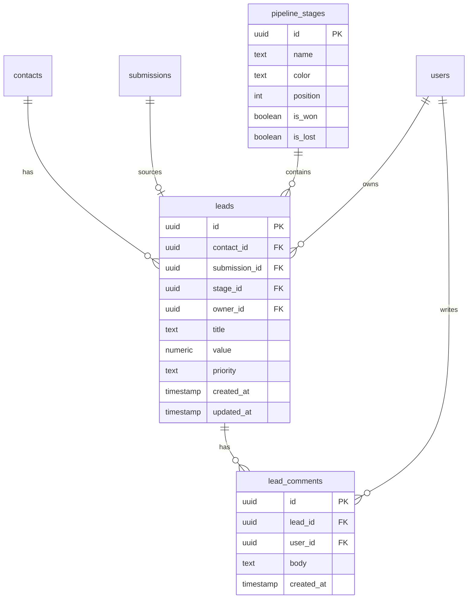

# Sales Pipeline — Plan implementacji (rev. 2)

## Cel

Centrum dowodzenia sprzedażą: leady z **wszystkich formularzy** trafiają automatycznie na tablicę Kanban,
gdzie zespół może zmieniać etap (drag-and-drop), dodawać komentarze, przypisywać menedżera i edytować
wartość/priorytet. Etapy są **konfigurowalne** (nazwa, kolejność, kolor).

---

## Zasady UX / design (obowiązują cały feature)

| Zasada | Implementacja |
|--------|---------------|
| **Optimistic UI** | Drag-drop i inline edits zmieniają store natychmiast → `PATCH` w tle → rollback on error z toastem |
| **Skeleton loading** | Zamiast spinnera — skeleton cards w kolumnach (szary pulsujący prostokąt) przy `fetchBoard` |
| **Toast feedback** | `useToast()` (centralny composable, już używany lub do stworzenia) — sukces `✓`, błąd `✕`, max 3s |
| **Empty states** | Każda pusta kolumna: „Drop leads here" (subtelny dashed border) + kolumna „New Lead" z CTA „+ Add lead" |
| **Keyboard nav** | `Escape` zamyka LeadDetailPanel, `Tab` przechodzi między polami edycji |
| **Debounce inline edits** | PATCH na `blur` + 500 ms debounce — nie bombardujemy API każdym keystroke |
| **Sticky column headers** | Nagłówki kolumn (`New (3) · 42k zł`) przyklejone przy pionowym scrollu kolumny |
| **Responsive** | Na mobile Kanban → pionowa lista kart z groupby stage (kolumny byłyby zbyt wąskie) |
| **Kolory etapów** | Pasek koloru na górze karty (3px) odpowiadający kolorowi etapu, zamiast pełnego tła |
| **Priorytet** | Badge `HIGH` (czerwony) / `MEDIUM` (żółty) / `LOW` (szary) — widoczny od razu na karcie |

---

## Architektura danych



**Reguły biznesowe:**
- Każde `POST /api/public/forms/:token/submit` tworzy **nowy lead** w pierwszym etapie (najniższy `position`).
- Tytuł: `contact.name` lub email; wartość: opcjonalnie z pola `value` / `amount` / `budget` w `submission.data`.
- `is_won` / `is_lost` → stany końcowe, wizualnie wyróżnione (np. zielone/czerwone tło nagłówka kolumny).
- Usunięcie etapu z leadami → przeniesienie leadów do pierwszego etapu (transakcja w serwisie).

---

## TODO w kolejności implementacji

```yaml
todos:
  - id: schema-types
    content: >
      Schema + typy + migracja + RBAC + seed
    status: pending

  - id: backend-services
    content: >
      LeadsModule: serwisy, kontrolery, DTOs, testy
    status: pending

  - id: form-integration
    content: >
      Hook auto-tworzenia leada w PublicFormsController + testy
    status: pending

  - id: pipeline-kanban-ui
    content: >
      pipeline.store + PipelineView Kanban + nawigacja
    status: pending

  - id: lead-detail-panel
    content: >
      LeadDetailPanel (slide-over) + komentarze + inline edit
    status: pending

  - id: stages-config-ui
    content: >
      PipelineStagesView (CRUD etapów, reorder, kolory)
    status: pending

  - id: manual-lead-create
    content: >
      Modal ręcznego dodawania leada + filtr menedżera
    status: pending
```

---

## 1. Schema + typy + migracja + RBAC + seed

### 1.1 `apps/api/src/core/database/schema.ts`

Dodać import `numeric` i trzy tabele na końcu pliku (NIE ruszać istniejących):

```typescript
import {
  pgTable, uuid, text, jsonb, timestamp, boolean, integer, numeric
} from 'drizzle-orm/pg-core';

export const pipelineStages = pgTable('pipeline_stages', {
  id:       uuid('id').defaultRandom().primaryKey(),
  name:     text('name').notNull(),
  color:    text('color').notNull().default('#3B82F6'),
  position: integer('position').notNull().default(0),
  isWon:    boolean('is_won').notNull().default(false),
  isLost:   boolean('is_lost').notNull().default(false),
});

export type LeadPriority = 'low' | 'medium' | 'high';

export const leads = pgTable('leads', {
  id:           uuid('id').defaultRandom().primaryKey(),
  contactId:    uuid('contact_id').references(() => contacts.id, { onDelete: 'cascade' }).notNull(),
  submissionId: uuid('submission_id').references(() => submissions.id, { onDelete: 'set null' }),
  stageId:      uuid('stage_id').references(() => pipelineStages.id, { onDelete: 'set null' }),
  ownerId:      uuid('owner_id').references(() => users.id, { onDelete: 'set null' }),
  title:        text('title').notNull(),
  value:        numeric('value'),
  priority:     text('priority').$type<LeadPriority>().notNull().default('medium'),
  createdAt:    timestamp('created_at').defaultNow().notNull(),
  updatedAt:    timestamp('updated_at').defaultNow().notNull(),
});

export const leadComments = pgTable('lead_comments', {
  id:        uuid('id').defaultRandom().primaryKey(),
  leadId:    uuid('lead_id').references(() => leads.id, { onDelete: 'cascade' }).notNull(),
  userId:    uuid('user_id').references(() => users.id, { onDelete: 'set null' }),
  body:      text('body').notNull(),
  createdAt: timestamp('created_at').defaultNow().notNull(),
});
```

### 1.2 Migracja

```bash
cd apps/api && npx drizzle-kit generate --name pipeline_leads
# tworzy drizzle/migrations/0002_pipeline_leads.sql
```

Zweryfikować że plik SQL wygenerowany poprawnie przed commitem.

### 1.3 `packages/types/src/index.ts`

```typescript
// Rozszerzyć Resource i Action
export type Resource = 'contacts' | 'forms' | 'newsletter' | 'settings' | 'integrations' | 'leads';
export type Action = 'read' | 'write' | 'admin' | 'manage';

// Nowe typy Pipeline
export type LeadPriority = 'low' | 'medium' | 'high';

export interface PipelineStage {
  id: string;
  name: string;
  color: string;
  position: number;
  isWon: boolean;
  isLost: boolean;
}

export interface Lead {
  id: string;
  contactId: string;
  submissionId: string | null;
  stageId: string | null;
  ownerId: string | null;
  title: string;
  value: string | null;   // numeric z Drizzle wraca jako string
  priority: LeadPriority;
  createdAt: string;
  updatedAt: string;
}

export interface LeadCard extends Lead {
  contactEmail: string;
  contactName: string | null;
  ownerEmail: string | null;
  formName: string | null;
  stageName: string | null;
}

export interface LeadBoardColumn {
  stage: PipelineStage;
  leads: LeadCard[];
  totalValue: number;
}

export interface LeadDetail extends LeadCard {
  submissionData: Record<string, unknown> | null;
  comments: LeadComment[];
}

export interface LeadComment {
  id: string;
  leadId: string;
  userId: string | null;
  userEmail: string | null;
  body: string;
  createdAt: string;
}

export interface CreateLeadDto {
  email: string;
  name?: string;
  value?: number;
  priority?: LeadPriority;
  stageId?: string;
  ownerId?: string;
}

export interface UpdateLeadDto {
  title?: string;
  value?: number | null;
  priority?: LeadPriority;
  stageId?: string;
  ownerId?: string | null;
}

export interface CreateCommentDto {
  body: string;
}

export interface Assignee {
  id: string;
  email: string;
}
```

### 1.4 RBAC seed w `bootstrap.service.ts`

Wzorzec identyczny jak dla istniejących uprawnień (idempotentny):

```typescript
{ resource: 'leads', action: 'manage' }
```

### 1.5 Seed domyślnych etapów (idempotentny)

```typescript
const DEFAULT_STAGES = [
  { name: 'New Lead',    color: '#3B82F6', position: 0, isWon: false, isLost: false },
  { name: 'Meeting Set', color: '#F59E0B', position: 1, isWon: false, isLost: false },
  { name: 'Negotiation', color: '#F97316', position: 2, isWon: false, isLost: false },
  { name: 'Won',         color: '#22C55E', position: 3, isWon: true,  isLost: false },
  { name: 'Lost',        color: '#EF4444', position: 4, isWon: false, isLost: true  },
];

// Sprawdzenie count, insert tylko gdy tabela pusta
const count = await db.select(...).from(pipelineStages).execute();
if (count[0].count === 0) {
  await db.insert(pipelineStages).values(DEFAULT_STAGES as any).execute();
}
```

---

## 2. LeadsModule

### Struktura

```
apps/api/src/modules/leads/
  leads.module.ts
  leads.controller.ts               # /api/leads
  pipeline-stages.controller.ts     # /api/pipeline/stages
  leads.service.ts
  pipeline-stages.service.ts
  dto/
    create-lead.dto.ts
    update-lead.dto.ts
    create-comment.dto.ts
    reorder-stages.dto.ts
```

### Endpointy (wszystkie z `SessionGuard` + `PermissionGuard` + `@RequirePermission('leads', 'manage')`)

| Method | Path | Opis |
|--------|------|------|
| GET | `/api/leads/board?ownerId=` | Kolumny + karty + suma wartości per kolumna |
| GET | `/api/leads/assignees` | `[{ id, email }]` — do dropdownu |
| GET | `/api/leads/:id` | Szczegóły + dane z formularza + komentarze |
| POST | `/api/leads` | Ręczne tworzenie (upsert contact) |
| PATCH | `/api/leads/:id` | title, value, priority, ownerId, stageId |
| POST | `/api/leads/:id/comments` | Nowy komentarz |
| GET | `/api/pipeline/stages` | Lista etapów posortowana po position |
| POST | `/api/pipeline/stages` | Nowy etap |
| PATCH | `/api/pipeline/stages/reorder` | `{ stageIds: string[] }` |
| PATCH | `/api/pipeline/stages/:id` | Edycja etapu |
| DELETE | `/api/pipeline/stages/:id` | Usuń + przenieś leady do pierwszego etapu (transakcja) |

### Uwaga o cyklu zależności

`PublicFormsController` (w `FormsModule`) wstrzyknie `LeadsService`.
`FormsModule` importuje `LeadsModule` — jednostronnie.
`LeadsModule` **nie** importuje `FormsModule`.

```typescript
// forms.module.ts
@Module({
  imports: [DatabaseModule, RbacModule, LeadsModule],
  ...
})
```

### Wzorzec `board` query (SQL join, nie N+1)

```typescript
// leads.service.ts → getBoard()
// 1. Pobierz wszystkie etapy (posortowane po position)
// 2. Pobierz wszystkie leady z JOIN contacts + users + forms (jednym zapytaniem)
// 3. Grupuj w JS: stages.map(stage => ({ stage, leads: byStage[stage.id] ?? [] }))
// 4. Policz totalValue per kolumna (parseFloat, NaN → 0)
```

### Testy (`makeChain()` — wzorzec z AGENTS.md)

- `leads.service.spec.ts` — `createFromSubmission`, `moveStage`, `getBoard` (agregacja)
- `pipeline-stages.service.spec.ts` — `reorder`, `deleteWithMigration`

---

## 3. Integracja z formularzami

`public-forms.controller.ts` — po `createSubmission()`, w bloku try:

```typescript
// Wstrzyknąć LeadsService przez konstruktor
await this.leads.createFromSubmission({
  contactId: contact.id,
  submissionId: submission.id,
  submissionData: validated,
  formName: form.name,
}).catch(err => this.logger.warn('Lead creation failed', err)); // nie przerywaj submita
```

> **Ważne:** błąd tworzenia leada NIE powinien przerywać całego submitu formularza — lead to efekt uboczny, nie core flow. Catch + log + kontynuuj.

---

## 4. Frontend

### 4.1 Nawigacja (`AppLayout.vue`)

Dodać do `staticNavItems` (między Forms a Roles):

```typescript
{ to: '/pipeline', label: 'Pipeline', icon: '📊' },
```

Dodać do `pageTitles`:

```typescript
pipeline: 'Pipeline',
'pipeline-stages': 'Pipeline Stages',
```

### 4.2 Router (`index.ts`)

```typescript
{
  path: '/pipeline',
  name: 'pipeline',
  component: () => import('../views/pipeline/PipelineView.vue'),
  meta: { requiresAuth: true },
},
{
  path: '/pipeline/stages',
  name: 'pipeline-stages',
  component: () => import('../views/pipeline/PipelineStagesView.vue'),
  meta: { requiresAuth: true },
},
```

> Panel szczegółów: **query param** `?lead=<id>` na `/pipeline` — nie osobna trasa.
> Przy zamknięciu panelu: `router.replace({ query: {} })`.

### 4.3 Store Pinia (`pipeline.store.ts`)

Wzorzec jak `forms.store.ts`:

```typescript
export const usePipelineStore = defineStore('pipeline', () => {
  const board = ref<LeadBoardColumn[]>([]);
  const stages = ref<PipelineStage[]>([]);
  const loading = ref(false);
  const error = ref<string | null>(null);

  async function fetchBoard(ownerId?: string) { ... }
  async function moveLead(leadId: string, stageId: string) {
    // OPTIMISTIC: zmień store od razu
    // PATCH /api/leads/:id { stageId }
    // ROLLBACK on error + toast
  }
  async function updateLead(id: string, dto: UpdateLeadDto) { ... }
  async function addComment(leadId: string, body: string) { ... }
  async function fetchStages() { ... }
  async function createStage(dto: ...) { ... }
  async function updateStage(id: string, dto: ...) { ... }
  async function deleteStage(id: string) { ... }
  async function reorderStages(stageIds: string[]) { ... }

  return { board, stages, loading, error, fetchBoard, moveLead, ... };
});
```

### 4.4 `PipelineView.vue` — Kanban

**Layout:**

```
┌──────────────────────────────────────────────────────────────┐
│ Pipeline               [+ Add lead]   Owner: [All ▼]  [⚙]   │
├──────────┬───────────┬───────────┬───────────┬───────────────┤
│ New (3)  │ Meeting   │ Nego (2)  │ ✓ Won (1) │ ✕ Lost (0)   │
│ 42k zł   │ (5) 148k  │ 21k       │ 300k      │ —             │
│ ──────── │ ───────── │ ───────── │ ───────── │ ─────────────│
│ [card]   │ [card]    │ [card]    │ [card]    │  (drop zone) │
│ [card]   │           │           │           │               │
└──────────┴───────────┴───────────┴───────────┴───────────────┘
```

**Karta leada** (dense, ale czytelna):

```
┌─────────────────────────────┐  ← pasek koloru etapu (3px top)
│ Jan Kowalski                │  ← bold, imię lub email
│ jan@example.com             │  ← subtext gdy jest imię
│ [Forms: Oferta] [HIGH] 5k zł│  ← badges w rzędzie
│                         JK  │  ← inicjały ownera (prawy dół)
└─────────────────────────────┘
```

**Drag-and-drop (natywne HTML5, bez bibliotek):**

```typescript
// Na karcie:
draggable="true"
@dragstart="onDragStart(lead.id)"
@dragend="dragging = null"

// Na kolumnie:
@dragover.prevent="onDragOver(stage.id)"
@dragleave="onDragLeave"
@drop="onDrop(stage.id)"

// Highlight kolumny podczas drag: klasa css `ring-2 ring-blue-500`
```

**Optimistic move:**

```typescript
async function onDrop(stageId: string) {
  if (!dragging.value) return;
  const leadId = dragging.value;
  store.moveLead(leadId, stageId); // optimistic w store
  // store obsługuje rollback on error
}
```

**Skeleton loading:**

```html
<template v-if="store.loading">
  <div v-for="i in 3" :key="i" class="h-24 bg-neutral-800 rounded-lg animate-pulse" />
</template>
```

**Empty state kolumny:**

```html
<div v-if="col.leads.length === 0"
  class="border-2 border-dashed border-neutral-700 rounded-lg p-4 text-center text-neutral-600 text-xs">
  Drop leads here
</div>
```

**Mobile fallback** (< 768px):

```html
<div class="md:hidden">
  <!-- Lista kart z groupby stage, każda grupa z nagłówkiem -->
</div>
<div class="hidden md:flex gap-4 overflow-x-auto">
  <!-- Kanban -->
</div>
```

### 4.5 `LeadDetailPanel.vue` — slide-over

**Animacja wejścia/wyjścia:**

```html
<Transition
  enter-from-class="translate-x-full"
  enter-to-class="translate-x-0"
  leave-to-class="translate-x-full"
  enter-active-class="transition-transform duration-200"
  leave-active-class="transition-transform duration-200"
>
  <div v-if="leadId" class="fixed right-0 top-0 h-full w-full max-w-md bg-neutral-900
                             border-l border-neutral-800 z-40 flex flex-col shadow-2xl">
```

**Struktura panelu:**

```
[×] Jan Kowalski · [New Lead ▾]      ← zamknięcie + inline stage select
────────────────────────────────
Priority: [HIGH ▾]   Value: [5000 zł]  Owner: [Jan K ▾]
────────────────────────────────
📋 Form data                          ← accordion, domyślnie zwinięty
  email: jan@example.com
  name: Jan Kowalski
  budget: 5000
────────────────────────────────
👤 Contact → /contacts/:id            ← link do kontaktu
────────────────────────────────
💬 Comments (2)
  [avatar] Admin · 2h ago
  "Umówiony na call w piątek"
  ─────
  [textarea „Add a comment..."]
  [Send]
```

**Inline edits:**

- `<select>` dla stage, priority, owner → `@change` → `store.updateLead()` z debounce
- `<input>` dla value → `@blur` → `store.updateLead()`
- Po zapisie: toast `✓ Saved`

**ESC key:**

```typescript
onMounted(() => {
  const handler = (e: KeyboardEvent) => {
    if (e.key === 'Escape') emit('close');
  };
  document.addEventListener('keydown', handler);
  onUnmounted(() => document.removeEventListener('keydown', handler));
});
```

**Form data** — czytelna lista zamiast surowego JSON:

```html
<dl class="space-y-1">
  <template v-for="(v, k) in lead.submissionData">
    <dt class="text-xs text-neutral-500">{{ k }}</dt>
    <dd class="text-sm text-neutral-200">{{ v }}</dd>
  </template>
</dl>
```

### 4.6 `PipelineStagesView.vue` — konfiguracja etapów

Prosta tabela z drag-reorder (lub strzałki ↑↓ — prościej):

```
┌──────────────────────────────────────────────────────┐
│ Pipeline Stages          [+ Add stage]               │
├──────────────────────────────────────────────────────┤
│ ↑↓  ● New Lead     #3B82F6  [Won □] [Lost □]  [🗑] │
│ ↑↓  ● Meeting Set  #F59E0B  [Won □] [Lost □]  [🗑] │
│ ↑↓  ● Won          #22C55E  [Won ✓] [Lost □]  [🗑] │
└──────────────────────────────────────────────────────┘
```

- Edycja inline: klik na nazwę → `<input>` on blur save
- Kolor: `<input type="color">` (natywne, bez bibliotek) + preview kółko obok
- Won/Lost: checkbox — walidacja: nie można zaznaczyć obu jednocześnie
- Usuń: confirmation dialog (`window.confirm` lub prosty `AppModal`) jeśli stage ma leady, info „X leads will be moved to first stage"
- Styl zgodny z resztą: `bg-neutral-900 border border-neutral-700 rounded-xl`

### 4.7 Modal ręcznego dodawania leada (`AddLeadModal.vue`)

Pola:
- Email (required, validate format)
- Name (optional)
- Stage (select, default: pierwszy)
- Priority (select, default: medium)
- Value (number, optional)
- Owner (select z `/api/leads/assignees`, optional)

Backend: upsert contact po email + insert lead.

---

## 5. Styl / design tokens (spójność z istniejącym UI)

```
Tła: bg-neutral-950 (app), bg-neutral-900 (sidebar/cards), bg-neutral-800 (hover/input)
Granice: border-neutral-800 (subtelne), border-neutral-700 (widoczne)
Tekst: text-white (primary), text-neutral-400 (secondary), text-neutral-600 (placeholder)
Akcenty: text-blue-400 / bg-blue-500 (primary action)
Danger: text-red-400 / bg-red-500
Won: text-green-400 / border-green-500
Lost: text-red-400 / border-red-500
Priority HIGH: bg-red-500/20 text-red-400
Priority MEDIUM: bg-yellow-500/20 text-yellow-400
Priority LOW: bg-neutral-700 text-neutral-400
```

---

## 6. Smoke test end-to-end (po zbudowaniu)

1. Submit formularza przez `/api/public/forms/:token/submit`
2. Otworzyć `/pipeline` → nowy lead widoczny w kolumnie „New Lead"
3. Drag-and-drop do „Meeting Set" → zmiana persystuje po odświeżeniu
4. Kliknąć kartę → panel otwiera się z danymi z formularza
5. Dodać komentarz → pojawia się w wątku
6. `/pipeline/stages` → dodać nowy etap → pojawia się na tablicy
7. Usunąć etap z leadami → leady przeniesione do „New Lead"

---

## Poza zakresem MVP

- Wiele równoległych pipeline'ów (per produkt)
- Automatyzacje / reguły routingu per `form.kind`
- Emisja eventów pluginowych (`lead.created`)
- Widok listy alternatywny do Kanbana
- Powiadomienia email/Slack
- Analytics konwersji (conversion rate, velocity)
